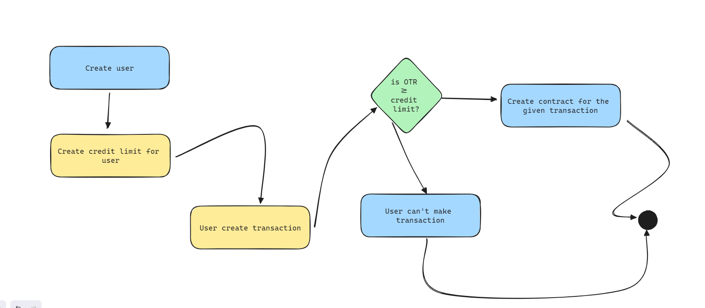

### credit-system

Database schema:
```sql
-- Create the Customer table
CREATE TABLE Customer (
  CustomerID SERIAL PRIMARY KEY,
  NIK VARCHAR(20) UNIQUE NOT NULL,
  FullName VARCHAR(100) NOT NULL,
  LegalName VARCHAR(100) NOT NULL,
  BirthPlace VARCHAR(50) NOT NULL,
  BirthDate DATE NOT NULL,
  Salary DECIMAL(15, 2) NOT NULL,
  PhotoKTP TEXT NOT NULL,
  PhotoSelfie TEXT NOT NULL
);

-- Create the CreditLimit table
CREATE TABLE CreditLimit (
  LimitID SERIAL PRIMARY KEY,
  CustomerID INT NOT NULL,
  Tenor INT NOT NULL,
  LimitAmount DECIMAL(15, 2) NOT NULL,
  FOREIGN KEY (CustomerID) REFERENCES Customer(CustomerID)
);

-- Create the Transaction table
CREATE TABLE Transaction (
  TransactionID SERIAL PRIMARY KEY,
  CustomerID INT NOT NULL,
  TransactionDate DATE NOT NULL,
  OTR DECIMAL(15, 2) NOT NULL,
  AdminFee DECIMAL(15, 2) NOT NULL,
  InstallmentAmount DECIMAL(15, 2) NOT NULL,
  InterestAmount DECIMAL(15, 2) NOT NULL,
  AssetName VARCHAR(100) NOT NULL,
  FOREIGN KEY (CustomerID) REFERENCES Customer(CustomerID)
);

-- Create the Contract table
CREATE TABLE Contract (
  ContractNumber VARCHAR(20) PRIMARY KEY,
  ContractDate DATE NOT NULL,
  Terms TEXT NOT NULL,
  TransactionID INT NOT NULL,
  Status VARCHAR(50) NOT NULL,
  FOREIGN KEY (TransactionID) REFERENCES Transaction(TransactionID)
);

```

System flowchart:



#### Notes
> Due to the lack of time, I have not implemented the whole system based on the requirements. I only did create the database schema and hexagonal pattern, and also implemented two APIs. I also did make a unit test using gomock. I think it's already cover the whole fundamental part of how I implemented the system using Golang.